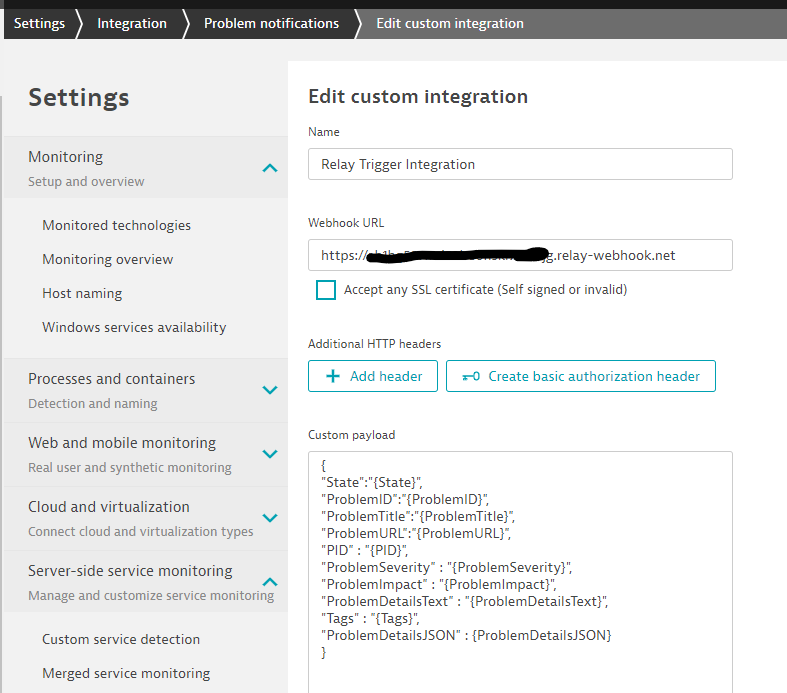

# dynatrace-trigger-event-fired

This [Dynatrace](www.dynatrace.com) trigger fires when a Dynatrace Problem notification webhook is sent to relay.
For more information check out the [Dynatrace Problem Notifications webhook documentation](https://www.dynatrace.com/support/help/setup-and-configuration/integrations/third-party-integrations/problem-notification-systems/webhook-integration/)

## Data Emitted 

Dynatrace gives you the flexiblity to define which problem details you want to pass to Relay. See an example below. The most common data points are listed here

| Name | Data type | Description | 
|------|-----------|-------------|
| State | string | Problem state. Possible values are OPEN or RESOLVED or in some cases MERGED when the problem has been merged into another problem | 
| ProblemID | string | Display number of the reported problem | 
| PID | string | Unique system identifier of the reported problem | 
| ProblemTitle | string | Short description of the problem | 
| ProblemURL | string | URL of the problem within Dynatrace | 
| ProblemSeverity | string | Severity level of the problem. Possible values are AVAILABILITY, ERROR, PERFORMANCE, RESOURCE_CONTENTION, or CUSTOM_ALERT |  
| ProblemImpact | string |  Impact level of the problem. Possible values are APPLICATION, SERVICE, or INFRASTRUCTURE |  
| Tags | string | Comma separated list of tags that are defined for all impacted entities.  |  
| ProblemDetailsText | string | All problem event details including root cause as a text-formatted string |
| ProblemDetailsJSON | string | All problem event details including root cause in form of a json object |  

## Example Trigger + Workflow 

This example can be triggered by a Dynatrace Problem. It also allows you to decide whether to make a call back to Dynatrace to add a comment
For this two-way integration to work you need to create two Relay secrets: dtapitoken and dtapiendpoint.

Example for secrets:
```
dtapitoken: ABCDEFGHADSFASDFA
dtapiendpoint: https://yourdynatrace.live.dynatrace.com
```

```
parameters:
  state:
    default: ""
  problemid:
    default: ""
  pid:
    default: ""
  problemtitle:
    default: ""
  problemurl:
    default: ""
  problemseverity:
    default: ""
  problemimpact:
    default: ""
  problemdetailstext:
    default: ""
  tags:
    default: ""

triggers:
- name: dynatrace-problem-event
  source:
    type: webhook
    image: relaysh/dynatrace-trigger-event-fired:latest
  binding:
    parameters:
      state: !Data State
      problemid: !Data ProblemId
      pid: !Data PID
      problemtitle: !Data ProblemTitle
      problemurl: !Data ProblemUrl 
      problemseverity: !Data ProblemSeverity
      problemimpact: !Data ProblemImpact
      problemdetailstext: !Data ProblemDetailsText
      tags: !Data Tags
steps:
- name: approval-post-problem-comment
  description: Do you want to post a comment on the Dynatrace problem?
  type: approval
- name: post-problem-comment
  image: relaysh/core
  input:
  - echo "$(ni get -p {.dtapiendpoint})/api/v1/problem/details/$(ni get -p {.pid})/comments"
  - echo "Authorization Api-Token $(ni get -p {.dtapitoken})"
  - | 
    set -x
    curl -X POST "$(ni get -p {.dtapiendpoint})/api/v1/problem/details/$(ni get -p {.pid})/comments" \
     -H "accept: application/json; charset=utf-8" \
     -H "Authorization: Api-Token $(ni get -p {.dtapitoken})" \
     -H "Content-Type: application/json; charset=utf-8" \
     -d "{\"comment\":\"This is a comment from Relay. We are working on this!!\",\"user\":\"Relay Workflow\",\"context\":\"Relay\"}"  
  dependsOn:
  - approval-post-problem-comment  
  spec:
    problemdetailstext: !Parameter problemdetailstext
    problemtitle: !Parameter problemtitle
    state: !Parameter state
    problemid: !Parameter problemid
    pid: !Parameter pid
    dtapitoken: !Secret dtapitoken
    dtapiendpoint: !Secret dtapiendpoint  
- name: log-problem-details
  image: relaysh/core
  spec:
    problemdetailstext: !Parameter problemdetailstext
    problemtitle: !Parameter problemtitle
    state: !Parameter state
    problemid: !Parameter problemid
    pid: !Parameter pid
  input:
  - echo "Here the details of the Dynatrace Problem"
  - echo "Title $(ni get -p {.problemtitle})"
  - echo "$(ni get -p {.problemdetailstext})"
  - echo "State $(ni get -p {.state})"
  - echo "ProblemId $(ni get -p {.problemid})"
  - echo "PID $(ni get -p {.pid})"
```

Once you have saved this workflow in Relay you can setup the Dynatrace Problem Notification Webhook by using the Webhook Entrypoint from Relay and the following custom payload in Dynatrace:

```
{
"State":"{State}",
"ProblemID":"{ProblemID}",
"ProblemTitle":"{ProblemTitle}",
"ProblemURL":"{ProblemURL}",
"PID" : "{PID}",
"ProblemSeverity" : "{ProblemSeverity}",
"ProblemImpact" : "{ProblemImpact}",
"ProblemDetailsText" : "{ProblemDetailsText}",
"Tags" : "{Tags}",
"ProblemDetailsJSON" : {ProblemDetailsJSON}
}
```
Here is a screenshot on how this configuration looks like in Dynatrace:


Once you run it - either through a *Send test notification* or a real Dynatrace problem notification you will see the workflow run
