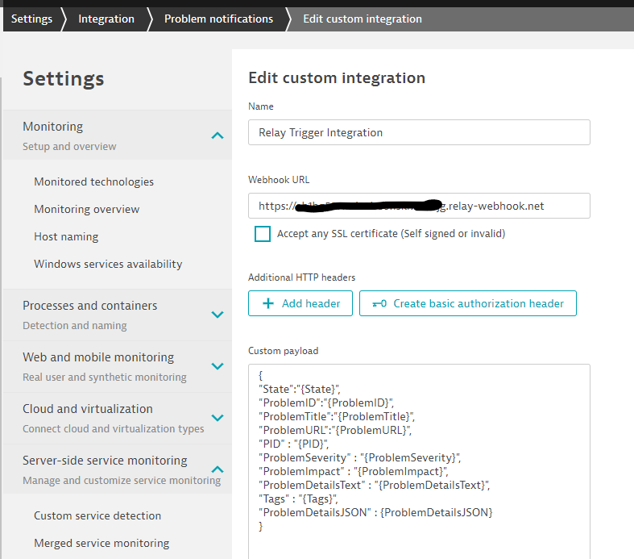

# dynatrace-respond-to-problem workflow

This workflow can be triggered by a Dynatrace Problem. It also allows you to decide whether to make a call back to Dynatrace to add a comment.
For this two-way integration to work you need to create two Relay secrets: dtapitoken and dtapiendpoint.

To add it to your relay account, either paste the contents of dynatrace-respond-to-problem.yaml in the web code editor or clone this repo and use the CLI:

```shell
relay workflow add dynatrace-respond-to-problem -f ./dynatrace-respond-to-problem.yaml
```

Example for secrets:

```shell
dtapitoken: ABCDEFGHADSFASDFA
dtapiendpoint: https://yourdynatrace.live.dynatrace.com
```

Once you have saved this workflow in Relay you can setup the Dynatrace Problem Notification Webhook by using the Webhook Entrypoint from Relay and the following custom payload in Dynatrace:

```json
{
"State":"{State}",
"ProblemID":"{ProblemID}",
"ProblemTitle":"{ProblemTitle}",
"ProblemURL":"{ProblemURL}",
"PID" : "{PID}",
"ProblemSeverity" : "{ProblemSeverity}",
"ProblemImpact" : "{ProblemImpact}",
"ProblemDetailsText" : "{ProblemDetailsText}",
"Tags" : "{Tags}",
"ProblemDetailsJSON" : {ProblemDetailsJSON}
}
```

Here is a screenshot on how this configuration looks like in Dynatrace:


Once you run it - either through a *Send test notification* or a real Dynatrace problem notification you will see the workflow run

